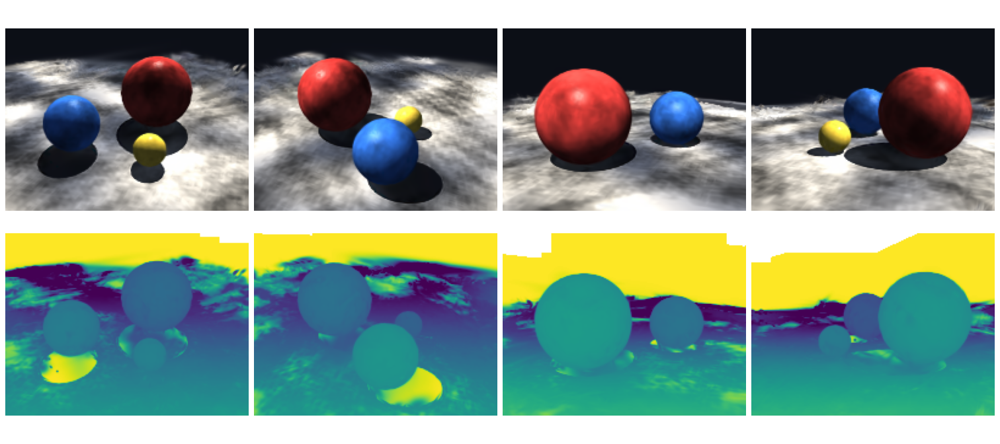
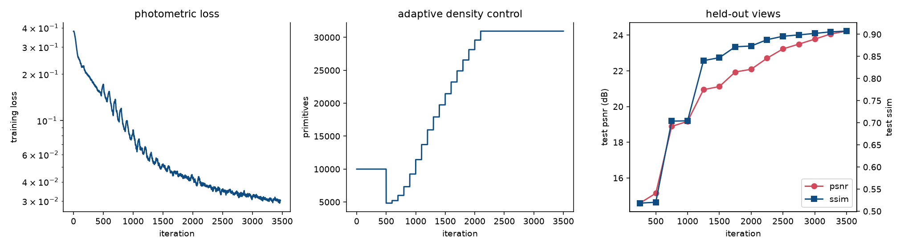
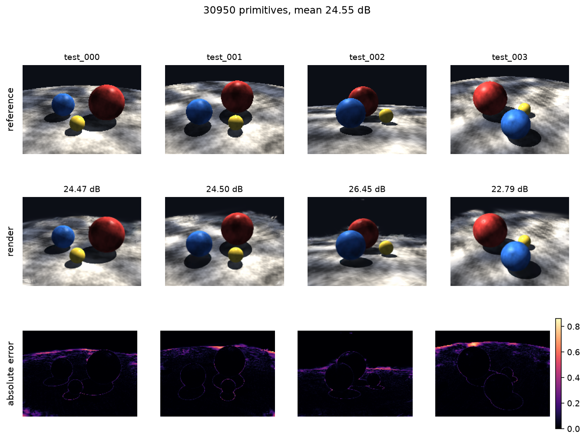

# 3D Gaussian Splatting

Un renderizador diferenciable que representa una escena como un conjunto de
gaussianas 3D anisótropas y las ajusta a imágenes con pose conocida por descenso
de gradiente. Escrito enteramente en PyTorch: la proyección EWA, el rasterizador
por tiles, el modelo de color con armónicos esféricos y el control adaptativo de
densidad están todos aquí, y la pasada hacia atrás sale de autograd y no de un
kernel CUDA escrito a mano.



*Puntos de vista nuevos, intercalados entre las cámaras de entrenamiento, con la
profundidad ponderada por alfa debajo de cada uno.*

## Cómo funciona

Una primitiva es una gaussiana 3D con una media, una covarianza anisótropa, una
opacidad y un desarrollo en armónicos esféricos para el color dependiente de la
vista. Renderizarla son cuatro pasos.

**Proyectar.** Una proyección en perspectiva no es afín, así que la imagen de una
gaussiana no es una gaussiana. EWA splatting linealiza la proyección en cada
centro y empuja la covarianza a través de esa aplicación lineal,
`Σ₂ᴅ = J W Σ Wᵀ Jᵀ`. La aproximación es buena mientras una primitiva subtiende un
ángulo pequeño, que es el régimen en el que opera la representación.

**Agrupar.** Componer cada primitiva contra cada píxel cuesta `O(H·W·N)`. En vez
de eso la imagen se parte en tiles y cada primitiva se asigna a los tiles que su
soporte solapa, con lo que el trabajo pasa a ser proporcional al área de pantalla
cubierta.

**Componer.** Dentro de un tile las primitivas se ordenan por profundidad y se
mezclan de delante hacia atrás, `C = Σᵢ cᵢ αᵢ Πⱼ<ᵢ (1 − αⱼ)`. El producto de
transmitancia parece secuencial, pero es un producto acumulado a lo largo del eje
de profundidad, así que un tile se evalúa como un puñado de operaciones tensoriales
por lotes que autograd diferencia directamente. Los gradientes se verifican contra
diferencias centradas en los tests.

**Densificar.** El descenso de gradiente puede mover, redimensionar y recolorear
primitivas, pero no puede cambiar cuántas hay. Donde el modelo está
infraparametrizado, el centro proyectado de una primitiva recibe un gradiente
grande y persistente, porque un solo splat está siendo estirado hacia varias
características de la imagen a la vez. Las primitivas pequeñas con gradiente
acumulado grande se clonan; las grandes se dividen en hijas muestreadas de su
propia distribución.

## Parametrización

Toda magnitud con rango restringido se almacena mediante una parametrización sin
restricciones, de modo que el descenso de gradiente nunca tiene que proyectarse de
vuelta a un conjunto factible.

| Magnitud | Se guarda como | Se recupera con |
| --- | --- | --- |
| escala | logaritmo | `exp` |
| opacidad | logit | `sigmoid` |
| rotación | cuaternión sin normalizar | normalizar y pasar a matriz |
| covarianza | escala y rotación | `R S Sᵀ Rᵀ` |
| color | coeficientes de armónicos esféricos | evaluar en la dirección de vista |

Factorizar la covarianza en lugar de guardar seis coeficientes libres es lo que
la mantiene semidefinida positiva durante toda la optimización; una matriz
simétrica sin restricciones se vuelve indefinida en unos cientos de pasos, y
entonces la cónica en pantalla no tiene interior.

## Notas de implementación que merece la pena leer

### El tope por tile y el artefacto que provoca

El intermedio denso de composición guarda una entrada por cada terna (tile,
primitiva, píxel), así que su tamaño es el número de píxeles por la ocupación del
tile más cargado. Esa ocupación depende de los datos y no está acotada, así que se
limita después de ordenar por profundidad, quedándose con las primitivas más
cercanas.

El tope suele salir gratis, porque una vez gastada la transmitancia las
primitivas restantes no pueden cambiar el píxel. Cuando *no* sale gratis el fallo
es característico y fácil de confundir con un problema de entrenamiento: tiles
vecinos truncan números distintos de primitivas y el render adquiere escalones
rectangulares visibles. Así se ve, con un tope de 512 sobre un modelo cuyo tile
más cargado tenía 1499 primitivas:

| tope | tiles saturados | transmitancia sin gastar | PSNR frente a sin truncar |
| ---: | ---: | ---: | ---: |
| 512 | 87 de 130 | 0.199 | 21.3 dB |
| 1024 | 27 de 130 | 0.032 | 43.5 dB |
| 2048 | 0 | 0.000 | exacto |

`RenderOutput` informa de ambas magnitudes y el entrenador imprime un aviso la
primera vez que la transmitancia sin gastar supera el uno por ciento, lo que
convierte una suposición en una medida.

El tamaño de tile es un compromiso relacionado y poco evidente. El trabajo denso
es el número de píxeles por la ocupación del tile más cargado; partir por la mitad
el lado del tile aproximadamente parte por la mitad esa ocupación y deja el número
de píxeles igual, mientras que lo que crece es el número de pares primitiva-tile
que hay que ordenar. Ocho píxeles es donde se equilibran ambos efectos para estas
escenas:

| tile | tiles | pares primitiva-tile | tile más cargado | elementos densos | render |
| ---: | ---: | ---: | ---: | ---: | ---: |
| 4 | 1 900 | 718 483 | 886 | 26.9 M | 328 ms |
| 8 | 475 | 220 320 | 1 096 | 33.3 M | 242 ms |
| 16 | 130 | 85 035 | 1 499 | 49.9 M | 315 ms |
| 32 | 35 | 40 061 | 2 755 | 98.7 M | 924 ms |

### Checkpointing de activaciones

Los tiles se componen por bloques dimensionados a un presupuesto fijo de
elementos, y bajo gradiente cada bloque se envuelve en
`torch.utils.checkpoint`. El pico de memoria pasa entonces a depender del
presupuesto y no del tamaño de imagen, a cambio de recalcular la pasada hacia
delante de cada bloque durante la pasada hacia atrás. A 400 × 300 con 40 000
primitivas en CPU:

| checkpointing | pico de memoria residente |
| --- | ---: |
| desactivado | 6.7 GB |
| activado | 3.2 GB |

Los tests comprueban que los gradientes son idénticos en ambos casos.

### Cirugía sobre el optimizador

La densificación cambia el número de filas de cada tensor de parámetros, así que
las estimaciones de primer y segundo momento de Adam hay que reindexarlas a la
vez. Tirar ese estado reiniciaría los momentos de todas las primitivas
supervivientes y estancaría el entrenamiento de forma visible tras cada pasada.
Las utilidades de [densify.py](src/gsplat/densify.py) recortan los momentos para
las supervivientes y rellenan con ceros para las nuevas, y los tests comprueban
ambas cosas directamente.

### Un techo para el tamaño del modelo

El umbral de gradiente en pantalla no acota el modelo. Es una propiedad de la
resolución de imagen y de la escena, así que un valor que produce un modelo
razonable a un megapíxel produce uno desaforadamente sobreparametrizado a una
décima parte. En este banco de pruebas a 160 × 120, el umbral publicado de `2e-4`
hizo crecer el modelo hasta 110 751 primitivas y el PSNR en vistas retenidas
*bajó* de 15.1 dB en la iteración 1 000 a 11.4 dB en la 6 000, con cinco
decibelios de diferencia respecto a las vistas de entrenamiento: la firma clásica
de estar memorizándolas. Subir el umbral y añadir un techo explícito reduce esa
diferencia a unas décimas de decibelio. El crecimiento se detiene en el techo
mientras la poda sigue activa, así que el modelo sigue mejorando reemplazando
primitivas en vez de añadiéndolas.

## Resultados

La escena de referencia son tres esferas de distinto tamaño y acabado sobre un
suelo de piedra jaspeada, trazada por rayos de forma analítica para que las poses
sean exactas. Los reflejos especulares barren las esferas conforme la cámara
orbita, cosa que solo puede reproducir un modelo de color dependiente de la
vista; el suelo lleva detalle aperiódico a varias escalas, que es lo que obliga al
control de densidad a dividir; y las sombras proyectadas son discontinuidades de
radiancia que no están alineadas con ninguna superficie.

Cuarenta vistas de entrenamiento sobre una órbita, ocho vistas retenidas
intercaladas a medio paso entre ellas, a 200 × 150. El modelo arranca con 10 000
primitivas colocadas uniformemente en una bola, sin nube de puntos con la que
inicializarse.

| | PSNR | SSIM |
| --- | ---: | ---: |
| Vistas de entrenamiento (40) | 24.74 dB | 0.9280 |
| Vistas retenidas (8) | **24.23 dB** | **0.9072** |

30 950 primitivas tras 3 500 iteraciones, 1 237 segundos sobre Metal.

La diferencia de medio decibelio entre las dos filas es el dato que hay que
mirar. Dice que el modelo está representando la escena en vez de memorizar las
cuarenta imágenes que se le enseñaron, que es exactamente lo que la configuración
anterior no conseguía.



La calidad en vistas retenidas sube de forma monótona en todo el recorrido. El
número de primitivas cae de 10 000 a 4 833 en la primera pasada de poda, que
elimina la inicialización aleatoria que no explica nada, y luego crece bajo
densificación hasta que la ventana se cierra en la iteración 2 100 y se congela
en 30 950.



El error residual se concentra en dos sitios: las siluetas de los objetos, donde
un número finito de gaussianas no puede producir un escalón, y el suelo lejano en
incidencia rasante, donde un píxel cubre una porción grande y escorzada de
textura.

Para reproducirlo:

```bash
gsplat train --scene synthetic --iterations 3500 --width 200 --height 150 \
             --init random --random-points 10000 --output out/
```

## Uso

```bash
pip install -e gaussian-splatting
```

Ajustar la escena procedural:

```bash
gsplat train --scene synthetic --output out/ --device auto
```

Ajustar una reconstrucción del proyecto de
[structure-from-motion](../structure-from-motion), inicializando desde su nube
dispersa:

```bash
sfm reconstruct fotos/ --output escena/
gsplat train --scene escena/ --images fotos/ --output out/
```

Renderizar vistas nuevas desde un checkpoint:

```bash
gsplat render out/model.npz --output turntable.png --views 6 --width 320
```

Volcar la escena procedural como imágenes y poses, que es lo que consume el
pipeline de reconstrucción:

```bash
gsplat export --output escena/ --views 24
```

`--device auto` elige Metal en Apple silicon, CUDA donde esté disponible y CPU en
otro caso. Metal va aproximadamente el doble de rápido que CPU en esta carga.

## Estructura

```
src/gsplat/
  spherical_harmonics.py  base real hasta grado tres
  cameras.py              cámaras pinhole, look-at, órbitas
  gaussians.py            el modelo y su parametrización
  projection.py           proyección EWA a cónicas en pantalla
  rasterizer.py           agrupado por tiles, orden por profundidad, composición diferenciable
  renderer.py             de modelo y cámara a imagen, en una llamada
  losses.py               L1, SSIM diferenciable, PSNR
  densify.py              control adaptativo de densidad y cirugía sobre el optimizador
  trainer.py              el bucle de optimización y sus planificaciones
  scenes.py               el trazador de rayos analítico y su textura procedural
  datasets.py             conjuntos de datos procedurales y en disco
  visualize.py            figuras de comparación, curvas y vueltas de cámara
  cli.py                  interfaz de línea de comandos
tests/                    55 tests, alrededor de medio minuto
```

## Alcance

El rasterizador está escrito buscando claridad y portabilidad, no velocidad. Un
kernel CUDA con pasada hacia atrás escrita a mano es uno o dos órdenes de
magnitud más rápido, y es la elección correcta para escenas de millones de
primitivas a resolución de megapíxel. Lo que compra esta implementación a cambio
es una pasada de composición que son una docena de líneas de álgebra tensorial,
corre sin cambios en CPU, Metal y CUDA, y está contrastada con diferenciación
numérica.

Las poses de cámara quedan fijas; el refinamiento conjunto de poses y geometría
no está implementado. Las primitivas que exceden el tope por tile se descartan en
vez de componerse en una aproximación de fondo. Se supone exposición y balance de
blancos constantes entre vistas, lo cual es cierto en datos renderizados y rara
vez lo es en una captura real.

La escena procedural es un banco de pruebas de síntesis de vistas, no de
emparejamiento de características. Tres esferas especulares lisas sobre un plano
de suelo, vistas desde una órbita completa, le dan muy poco a SIFT: la apariencia
de las esferas depende de la vista, el suelo se ve en ángulos rasantes que cambian
bruscamente entre vistas, y el fondo está vacío. Una reconstrucción hecha con
estos renders registra solo una fracción de las vistas, lo cual dice algo de las
imágenes y no del pipeline. El relevo entre los dos proyectos es una interfaz de
ficheros, ejercitada por los tests y por la vía `--scene <directorio>` de arriba;
demostrar la cadena completa de punta a punta pide una captura real.

## Referencias

* Kerbl, Kopanas, Leimkühler y Drettakis, *3D Gaussian Splatting for Real-Time Radiance Field Rendering*, SIGGRAPH 2023.
* Zwicker, Pfister, van Baar y Gross, *EWA Volume Splatting*, IEEE Visualization 2001.
* Mildenhall, Srinivasan, Tancik, Barron, Ramamoorthi y Ng, *NeRF: Representing Scenes as Neural Radiance Fields for View Synthesis*, ECCV 2020.
* Wang, Bovik, Sheikh y Simoncelli, *Image Quality Assessment: From Error Visibility to Structural Similarity*, TIP 2004.
* Chen y Wang, *A Survey on 3D Gaussian Splatting*, 2024.
