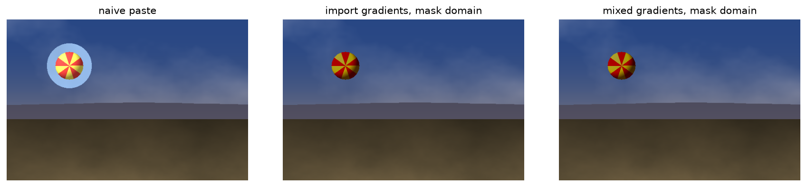
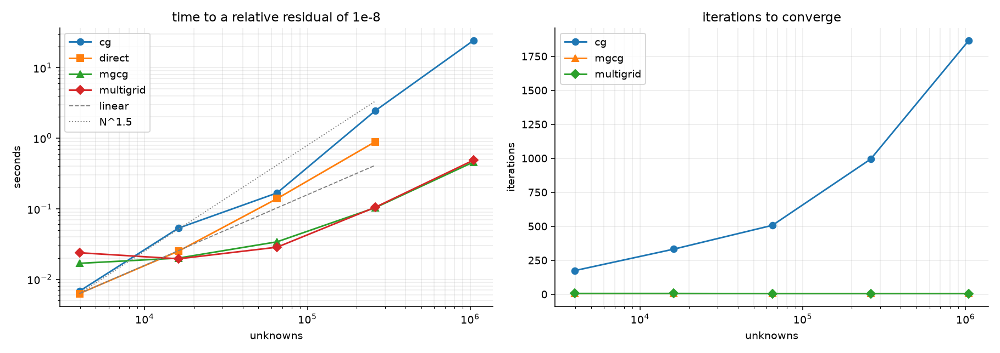
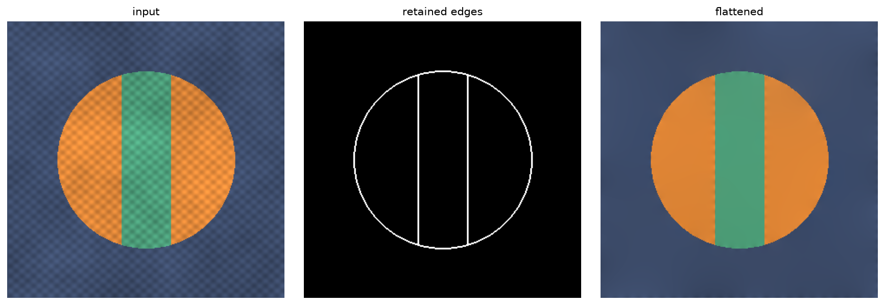
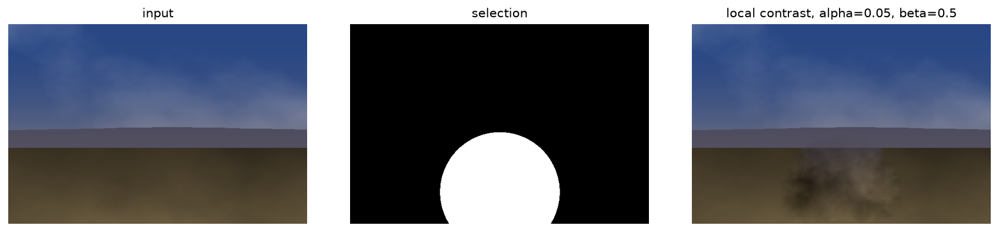
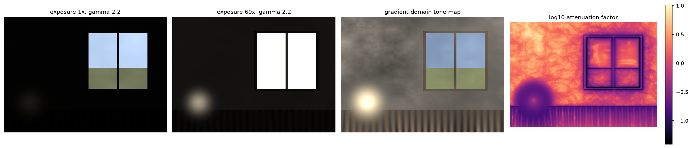

# Procesamiento en el Dominio del Gradiente

Composición sin costuras, aplanado de textura, realce de contraste local y mapeo
tonal de alto rango dinámico, todo construido sobre el mismo cálculo: elegir un
campo de gradiente objetivo y reconstruir la imagen cuyo gradiente más se le
parece. El paso de integración está implementado de cuatro maneras, desde una
factorización dispersa directa hasta un ciclo V multigrid geométrico escrito
desde cero.



## La única idea

Todo lo de aquí minimiza

```
min_u  ∫ |∇u − v|²        sujeto a condiciones de contorno,
```

donde `v` es un campo de gradiente objetivo que, en general, no es el gradiente
de ninguna imagen. Las ecuaciones normales de ese problema de mínimos cuadrados
son la ecuación de Poisson `∇²u = ∇·v`, así que las aplicaciones solo se
diferencian en cómo se elige `v`:

| Aplicación | Campo guía | Condición de contorno |
| --- | --- | --- |
| Clonado sin costura | gradientes de la fuente dentro de la selección | valores del destino alrededor |
| Gradientes mezclados | el mayor de los dos gradientes | valores del destino |
| Aplanado de textura | gradientes de la imagen enmascarados por un mapa de bordes | la propia imagen |
| Contraste local | gradientes reescalados por `(α/‖∇f‖)^β` | los píxeles de alrededor |
| Mapeo tonal | gradientes del log-radiancia atenuados multiescala | Neumann, nada fijado |

Como el gradiente y la divergencia discretos de
[operators.py](src/gradient_domain/operators.py) son un par adjunto exacto, el
sistema resultante es simétrico, que es lo que permite aplicar gradiente
conjugado y multigrid. La relación de adjunción se comprueba directamente en los
tests en lugar de darse por supuesta.

## Solvers

Cuatro métodos resuelven el mismo sistema de Dirichlet, que es lo que hace
significativa la comparación de abajo.

**Directo.** LU dispersa del laplaciano de cinco puntos. Exacto, y la elección
correcta cuando un mismo operador sirve a muchos términos independientes, ya que
la factorización se calcula una vez y se reutiliza entre canales de color. El
llenado es lo que acaba descartándolo.

**Gradiente conjugado.** Sin matriz, memoria proporcional a la malla. El número
de iteraciones crece con el número de condición del laplaciano, que crece con el
número de píxeles, así que el trabajo total es superlineal.

**Multigrid.** La relajación mata el error de alta frecuencia en unas pocas
pasadas y luego se estanca, porque el error que queda es suave. Un error suave en
una malla fina no es suave en una malla dos veces más gruesa, así que un ciclo V
lo relaja allí, a la cuarta parte del coste, de forma recursiva. Las
transferencias de malla son la interpolación bilineal y su adjunta escalada, y el
suavizador es una pasada Gauss-Seidel rojo-negro escrita como dos expresiones de
arrays.

**Gradiente conjugado precondicionado con multigrid.** Un ciclo V como
precondicionador. El engrosamiento lleva `m` puntos interiores a `(m − 1) // 2`,
que solo es exacto cuando el tamaño es impar; con tamaños de imagen arbitrarios
el ciclo simple pierde parte de su factor de convergencia, y envolverlo en
gradiente conjugado lo recupera. Es la opción por defecto.

Un quinto solver se ocupa del problema de Neumann que plantea el mapeo tonal.
Reflejar el dominio convierte el laplaciano en un operador que la transformada
discreta del coseno diagonaliza, así que esa resolución es una transformada, una
división y una transformada inversa: exacta y sin iterar.

## Escalado

Cada solver corre sobre el mismo problema manufacturado, llevado hasta un residuo
relativo de `1e-8`. Los tiempos son de un solo hilo en una CPU Apple de la serie M.



| Malla | Incógnitas | Método | Iteraciones | Segundos |
| --- | ---: | --- | ---: | ---: |
| 63 × 63 | 3 969 | direct | – | 0.006 |
| 63 × 63 | 3 969 | cg | 174 | 0.007 |
| 63 × 63 | 3 969 | mgcg | 7 | 0.017 |
| 255 × 255 | 65 025 | direct | – | 0.139 |
| 255 × 255 | 65 025 | cg | 507 | 0.167 |
| 255 × 255 | 65 025 | mgcg | 7 | 0.034 |
| 511 × 511 | 261 121 | direct | – | 0.892 |
| 511 × 511 | 261 121 | cg | 994 | 2.450 |
| 511 × 511 | 261 121 | mgcg | 7 | 0.104 |
| 1023 × 1023 | 1 046 529 | cg | 1 866 | 24.230 |
| 1023 × 1023 | 1 046 529 | mgcg | 7 | 0.459 |

Lo importante son los conteos de iteraciones. El gradiente conjugado necesita
174, luego 507 y luego 1866 iteraciones conforme crece la malla, aproximadamente
en proporción al lado, exactamente como predice el número de condición del
laplaciano. Las variantes multigrid necesitan siete, en todos los tamaños. A un
megapíxel eso es un factor de 53 en tiempo de reloj, y la brecha se ensancha con
la resolución.

Para reproducirlo:

```bash
gradient-domain benchmark --sizes 63 127 255 511 1023
```

## Aplicaciones

### Clonado sin costura

Copiar píxeles transfiere el color absoluto de la fuente, que rara vez encaja con
el destino. Copiar gradientes transfiere solo la variación relativa; el nivel
absoluto viene del destino a través de la condición de contorno, así que el
inserto adopta la iluminación de su entorno. El globo de arriba está compuesto a
partir de un recorte fotografiado un paso más luminoso y mucho más frío que la
escena de atardecer en la que aterriza, y nada de esa diferencia sobrevive.

Hay dos formulaciones implementadas y merece la pena conocer la diferencia.

* **Dominio máscara.** Las incógnitas son los píxeles seleccionados; el anillo
  que los rodea aporta los valores de Dirichlet. Es Pérez, Gangnet y Blake
  (2003). El destino se preserva exactamente fuera de la selección, que es lo que
  una herramienta de edición debería garantizar, pero el dominio es irregular y
  el sistema hay que montarlo y factorizarlo explícitamente.
* **Dominio rectángulo.** Las incógnitas son un rectángulo alrededor de la
  selección, con el gradiente de la fuente dentro y el del destino fuera. El
  dominio es regular, así que multigrid se aplica. Fuera de la selección el
  resultado difiere del destino en una función armónica con valores de contorno
  nulos: en este ejemplo, `3.5e-4` de media.

Los tests comprueban tanto la exactitud de la primera como la cercanía de la
segunda.

La costura solo desaparece si pasa por donde fuente y destino son
verosímilmente parecidos. Aquí la selección es un disco bastante mayor que el
globo, de modo que la frontera cae en el propio cielo de la fuente. Una selección
ajustada al objeto pone la frontera sobre el objeto mismo, y entonces la
diferencia de iluminación se absorbe en los colores del objeto en vez de en su
entorno.

### Aplanado de textura



Multiplicar el gradiente de la imagen por un indicador de bordes e integrar
fuerza a toda región sin borde a quedar tan plana como sus fronteras permitan. La
estructura sobrevive, la textura no.

### Contraste local



Remapear las magnitudes de gradiente con `(α/‖∇f‖)^β` dentro de una selección
amplifica las pequeñas y atenúa las grandes, lo que saca detalle de una zona en
sombra. La condición de contorno garantiza que el resultado encuentra la imagen
intacta de forma continua, así que no aparece ningún borde en la selección.

### Mapeo tonal



El mapa de radiancia sintético abarca 5.5 décadas; una pantalla cubre unas dos.
Cualquier curva global tiene que elegir, que es lo que muestran los dos primeros
paneles. El método en el dominio del gradiente (Fattal, Lischinski y Werman,
2002) atenúa los gradientes con un factor que decrece con su magnitud, así que
los saltos grandes que cargan con el rango dinámico se encogen y los pequeños que
cargan con el detalle no.

La atenuación se calcula sobre una pirámide gaussiana y se propaga de grueso a
fino. Eso importa: un borde grande no es un único gradiente grande a resolución
completa, es una rampa repartida entre muchos píxeles, cada uno de ellos
moderado. Calcular el factor solo a resolución completa dejaría esas rampas
intactas.

Ojo con el convenio de signo, que es una fuente habitual de confusión. Aquí
`β = 1` es la identidad y los valores más pequeños comprimen más, siguiendo el
artículo original. El exponente del operador de contraste local de arriba va al
revés, siguiendo a Pérez et al.; ambos están implementados con su propio convenio
y ambos están documentados donde se definen.

## Uso

```bash
pip install -e gradient-domain
gradient-domain demo --output outputs
```

Demostraciones individuales:

```bash
gradient-domain clone     --output outputs --domain mask
gradient-domain flatten   --output outputs --method mgcg
gradient-domain relight   --output outputs --alpha 0.05 --beta 0.5
gradient-domain tonemap   --output outputs --beta 0.88
gradient-domain benchmark --output outputs --sizes 63 127 255 511 1023
```

Todas las entradas se generan proceduralmente, así que no hay nada que descargar
y todas las figuras de este README son reproducibles desde un clon limpio.

Usando la librería directamente:

```python
import numpy as np
from gradient_domain import seamless_clone, make_compositing_example

ejemplo = make_compositing_example()
resultado, informes = seamless_clone(
    ejemplo.source, ejemplo.target, ejemplo.mask, ejemplo.offset,
    mode="mixed", domain="rectangle", method="mgcg",
)
print(informes[0])
```

## Estructura

```
src/gradient_domain/
  operators.py   gradiente, divergencia, laplaciano, plegado del contorno
  multigrid.py   ciclo V, Gauss-Seidel rojo-negro, transferencias de malla
  solvers.py     directo, CG, multigrid, MGCG y el solver de Neumann por DCT
  poisson.py     campos guía y las operaciones de edición
  hdr.py         atenuación multiescala de gradientes y mapeo tonal
  synthetic.py   imágenes procedurales, incluido un mapa de radiancia de 5.5 décadas
  benchmark.py   el estudio de escalado
  visualize.py   figuras
  cli.py         interfaz de línea de comandos
tests/           42 tests, alrededor de un segundo
```

## Alcance

El solver multigrid maneja dominios rectangulares de Dirichlet. Las selecciones
irregulares pasan por la factorización directa, que es exacta y suficientemente
rápida a los tamaños que produce una selección interactiva, pero no escala como
el ciclo V. Extender multigrid a dominios irregulares requiere engrosar la
máscara junto con la malla, o una construcción algebraica de los operadores
gruesos; ambas son trabajo real y ninguna está aquí.

Los canales de color se resuelven de forma independiente, que es lo habitual y es
la razón por la que la factorización se reutiliza en vez de recalcularse. Nada
impone coherencia entre canales, así que un campo guía incoherente entre ellos
produce un desplazamiento de tono en lugar de un error.

## Referencias

* Pérez, Gangnet y Blake, *Poisson Image Editing*, SIGGRAPH 2003.
* Fattal, Lischinski y Werman, *Gradient Domain High Dynamic Range Compression*, SIGGRAPH 2002.
* Agarwala, *Efficient Gradient-Domain Compositing Using Quadtrees*, SIGGRAPH 2007.
* Bhat, Zitnick, Cohen y Curless, *GradientShop: A Gradient-Domain Optimization Framework for Image and Video Filtering*, TOG 2010.
* Briggs, Henson y McCormick, *A Multigrid Tutorial*, 2ª edición, SIAM 2000.
* Wang, Bovik, Sheikh y Simoncelli, *Image Quality Assessment: From Error Visibility to Structural Similarity*, TIP 2004.
