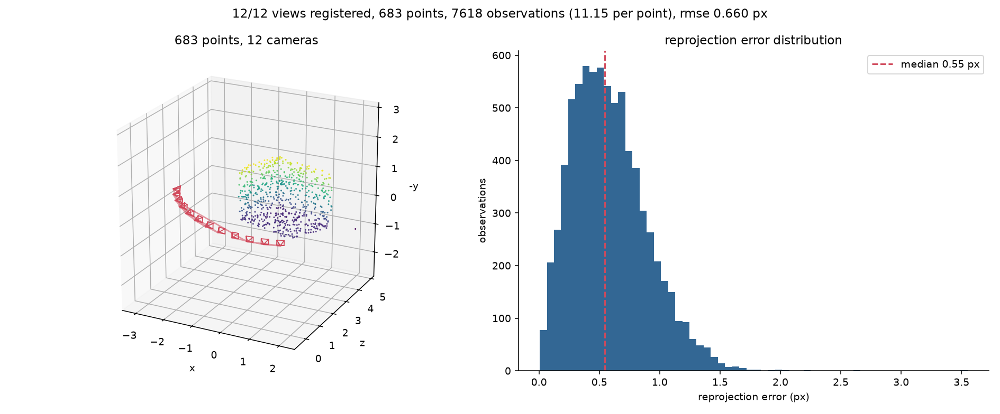

# Structure from Motion

Incremental structure from motion for calibrated cameras, written on top of NumPy
and SciPy. The geometry is implemented from first principles: the minimal
essential-matrix solver, triangulation, absolute pose estimation, track
construction and the bundle adjuster are all in this repository. OpenCV is used
only for image decoding and SIFT description.



## Pipeline

| Stage | Module | Method |
| --- | --- | --- |
| Detection and description | [features.py](src/sfm/features.py) | SIFT, L2-normalized descriptors |
| Matching | [features.py](src/sfm/features.py) | Blocked brute force, Lowe ratio test, mutual consistency |
| Two-view geometry | [five_point.py](src/sfm/five_point.py), [epipolar.py](src/sfm/epipolar.py) | Five-point essential solver inside MSAC with local optimization |
| Track building | [tracks.py](src/sfm/tracks.py) | Union-find over verified matches, conflicting components rejected |
| Triangulation | [triangulation.py](src/sfm/triangulation.py) | Multi-view DLT followed by Gauss-Newton refinement |
| Registration | [pnp.py](src/sfm/pnp.py) | Normalized DLT inside RANSAC, then robust Levenberg-Marquardt |
| Refinement | [bundle.py](src/sfm/bundle.py) | Sparse Levenberg-Marquardt with the Schur complement and a Huber loss |
| Orchestration | [reconstruction.py](src/sfm/reconstruction.py) | Seed pair, incremental registration, interleaved local and global refinement |

## Implementation notes

### Five-point minimal solver

Five correspondences between calibrated views leave a four-dimensional null space
of the epipolar constraint, so the essential matrix is written as
`E = x E1 + y E2 + z E3 + E4`. Substituting that into the two algebraic
properties of an essential matrix,

```
det(E) = 0        2 E Eᵀ E − trace(E Eᵀ) E = 0
```

produces ten cubic polynomials in three unknowns. Expressed in the twenty
monomials of degree at most three, the system is a `10 × 20` matrix whose leading
`10 × 10` block is generically invertible. Eliminating it writes every cubic
monomial in the quotient-ring basis `{x², xy, y², xz, yz, z², x, y, z, 1}`, which
is exactly what is needed to build the matrix of multiplication by `x` in the
quotient ring; its eigenvectors are the basis monomials evaluated at the
solutions.

The polynomial system is assembled symbolically at run time from the null-space
basis rather than from hard-coded coefficient tables, so the construction can be
read and checked against the derivation. The tests verify that every returned
matrix has singular values `(σ, σ, 0)`, satisfies the epipolar constraint to
machine precision, and that the ground-truth matrix is among the solutions.

Compared with the eight-point algorithm this halves the RANSAC sample. At a
50 percent inlier ratio the expected number of hypotheses drops by roughly two
orders of magnitude, and the essential constraints are enforced exactly instead
of being restored by projecting a general matrix afterwards.

### Bundle adjustment

The normal equations of a reconstruction have the block structure

```
| U   W | | δ_c |   | g_c |
|       | |     | = |     |
| Wᵀ  V | | δ_p |   | g_p |
```

with one `6 × 6` block per camera in `U`, one `3 × 3` block per point in `V`, and
one `6 × 3` block per observation in `W`. Since `V` is block diagonal it inverts
in closed form, and eliminating the points gives the reduced camera system
`(U − W V⁻¹ Wᵀ) δ_c = g_c − W V⁻¹ g_p`, whose size depends only on the number of
views. That is what makes the step affordable: for a few hundred cameras and a
hundred thousand points the dense system is out of reach, while the reduced one
is a sparse solve with a few thousand unknowns.

Three details matter in practice.

* Rotations are updated multiplicatively, `R ← exp(skew(δ)) R`. The increment is
  a local chart around the current estimate, so the Jacobian of a rotated point
  is the cross-product matrix `−skew(R X)` and no chart singularity is ever
  approached. The Jacobian is checked against central differences in the tests.
* Residuals are reweighted with a Huber loss, so surviving mismatches bend the
  solution by a bounded amount. Turning the loss off measurably degrades the
  poses on contaminated data, which the tests assert.
* A free reconstruction has seven gauge degrees of freedom. Holding one pose
  constant removes six of them; the remaining scale freedom is absorbed by the
  Levenberg-Marquardt damping, which keeps the reduced system positive definite.
  Structure therefore has to be aligned by a similarity before it is compared
  against ground truth.

The solver is validated against `scipy.optimize.least_squares` running
trust-region reflective on the same problem with a numerically differentiated
sparse Jacobian. The two final costs have to agree within two percent.

### Robust estimation

[ransac.py](src/sfm/ransac.py) is model agnostic: callers supply a minimal
solver and a residual function. It scores hypotheses with the truncated squared
error of MSAC rather than a raw inlier count, so two models with the same inlier
set are still ranked by how well they explain it, and it re-fits on the inlier
set whenever the best score improves. That local optimization step is what makes
a minimal sample competitive with a non-minimal fit, and by enlarging the inlier
set it also tightens the adaptive iteration bound.

## Accuracy on the synthetic benchmark

Twelve cameras on a 90 degree arc observe 800 points spread over three
orthogonal walls. Isotropic Gaussian noise is added to every projection and a
fraction of the observations is displaced by a gross error with a standard
deviation of 40 pixels. Structure and pose errors are measured after aligning
the reconstruction to ground truth with a similarity transform; the scene is
about 6 units across.

| Noise (px) | Outliers | Views | Points | RMSE (px) | Rotation, median (deg) | Centre, median | Structure, median |
| ---: | ---: | ---: | ---: | ---: | ---: | ---: | ---: |
| 0.0 | 0 % | 12/12 | 724 | 0.000 | 0.0000 | 0.00000 | 0.00000 |
| 0.0 | 15 % | 12/12 | 676 | 0.075 | 0.0043 | 0.00015 | 0.00045 |
| 0.5 | 0 % | 12/12 | 715 | 0.661 | 0.0195 | 0.00101 | 0.00271 |
| 0.5 | 15 % | 12/12 | 675 | 0.657 | 0.0074 | 0.00086 | 0.00233 |
| 1.0 | 0 % | 12/12 | 711 | 1.322 | 0.0478 | 0.00203 | 0.00614 |
| 1.0 | 15 % | 12/12 | 646 | 1.298 | 0.0325 | 0.00188 | 0.00529 |
| 1.5 | 0 % | 12/12 | 547 | 1.869 | 0.0745 | 0.00340 | 0.00930 |
| 1.5 | 15 % | 12/12 | 538 | 1.828 | 0.0867 | 0.00312 | 0.01126 |

Reproduce a row with

```bash
sfm demo --views 12 --points 800 --noise 0.5 --outliers 0.15 --seed 5
```

Two observations. The residual RMSE tracks the injected noise almost exactly,
which is the signature of an estimator that is not absorbing measurement noise
into the model. Adding outliers lowers the point count, because contaminated
matches destroy the tracks they touch, but it barely moves the pose error: that
is the robust loss and the geometric verification doing their job.

## Usage

```bash
pip install -e structure-from-motion
```

Reconstruct a folder of images:

```bash
sfm reconstruct path/to/images --output out/ --fov 62
```

The output directory receives `points.ply`, a `cameras.json` with the calibrated
poses, and a summary figure. Both files are consumed directly by the
[Gaussian splatting](../gaussian-splatting) project in this repository, which is
the same handover a real pipeline performs between a sparse reconstructor and a
renderer.

Without `--fov` the focal length is guessed from a 55 degree horizontal field of
view. That is enough to get a reconstruction started on casual captures, but
bundle adjustment holds intrinsics fixed, so a badly wrong guess shows up as
systematic error that no amount of optimization removes.

Run the synthetic benchmark instead, which needs no input data:

```bash
sfm demo --views 12 --points 800 --output out/
```

## Layout

```
src/sfm/
  rotations.py       SO(3) exponential and logarithm, local Jacobians
  camera.py          pinhole intrinsics, rigid poses, projection
  ransac.py          model-agnostic MSAC with local optimization
  five_point.py      minimal essential-matrix solver
  epipolar.py        eight-point solver, Sampson error, pose recovery
  triangulation.py   linear and nonlinear triangulation
  pnp.py             normalized DLT pose, robust refinement
  tracks.py          union-find feature tracks
  bundle.py          sparse Levenberg-Marquardt with the Schur complement
  reconstruction.py  the incremental loop
  metrics.py         similarity alignment and pose error metrics
  io.py              PLY and camera serialization
  synthetic.py       ground-truth scene generator
  visualize.py       result figures
  cli.py             command line interface
tests/               47 tests, roughly three seconds
```

## Scope

Intrinsics are fixed during optimization, so lens distortion has to be removed
beforehand and the focal length has to be known or guessed well. Matching is
exhaustive and therefore quadratic in the number of images, which is the right
choice up to a few dozen views and the wrong one beyond that; larger collections
need an image-retrieval step to shortlist pairs. Registration uses a six-point
DLT rather than a three-point solver, which costs RANSAC iterations but is not
the bottleneck at the inlier ratios that verified tracks produce.

## References

* Nistér, *An Efficient Solution to the Five-Point Relative Pose Problem*, PAMI 2004.
* Stewénius, Engels and Nistér, *Recent Developments on Direct Relative Orientation*, ISPRS 2006.
* Hartley, *In Defense of the Eight-Point Algorithm*, PAMI 1997.
* Hartley and Zisserman, *Multiple View Geometry in Computer Vision*, 2nd edition, 2004.
* Triggs, McLauchlan, Hartley and Fitzgibbon, *Bundle Adjustment: A Modern Synthesis*, 1999.
* Chum, Matas and Kittler, *Locally Optimized RANSAC*, DAGM 2003.
* Torr and Zisserman, *MLESAC: A New Robust Estimator*, CVIU 2000.
* Schönberger and Frahm, *Structure-from-Motion Revisited*, CVPR 2016.
